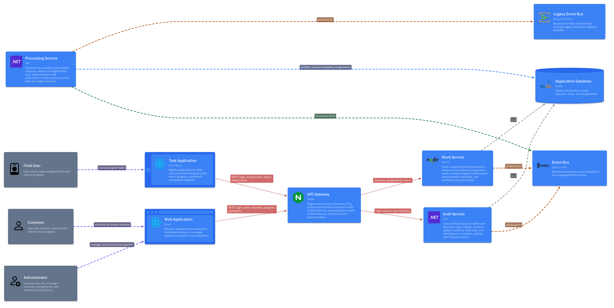

# Workline

Workline is a request and field-work platform. Customers submit work from the
browser, field users pick up assigned tasks on a mobile app, and administrators
provision accounts and clear exceptions when a job cannot proceed.

## Architecture

Open the [interactive architecture](https://kborys-onerail.github.io/like-c4-repo/#/view/index)
to click through elements and replay request flows.

Traffic enters through an NGINX API gateway. Auth Service owns login, tokens,
and the user directory. Work Service owns requests, assignments, and status.
Processing Service runs asynchronously: it enriches submissions, chooses an
eligible field user, and keeps the read projections the clients query. Kafka
carries the live event bus; a legacy Azure Event Hubs channel is still mirrored
until its consumer migrates. MySQL is the system of record.

How this diagram is modelled, exported, and kept in sync is documented in
[`docs/likec4/README.md`](docs/likec4/README.md).

## Applications

| Path | Role |
| --- | --- |
| [`apps/web-app`](apps/web-app) | React SPA for customers and administrators |
| [`apps/task-app`](apps/task-app) | React Native app for field users |
| [`apps/api-gateway`](apps/api-gateway) | TLS termination and routing; owns no business data |
| [`apps/auth-service`](apps/auth-service) | Credentials, tokens, and user lifecycle events |
| [`apps/work-service`](apps/work-service) | Requests, assignments, progress, and exceptions |
| [`apps/processing-service`](apps/processing-service) | Async enrichment, assignment, and projections |
